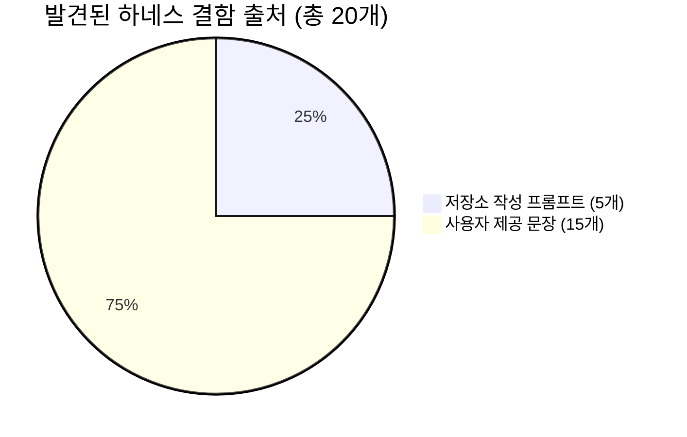
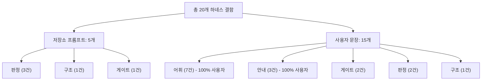
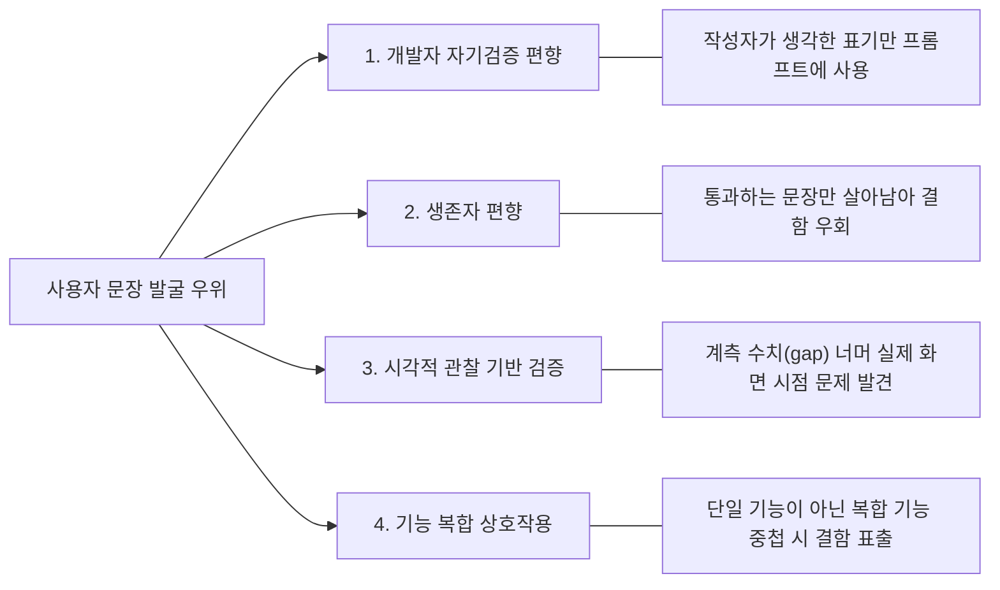

# 왜 사용자가 준 문장이 저장소 프롬프트보다 결함을 더 많이 찾았나

> **문서 정보**
> - **작성일**: 2026-07-30
> - **분석 대상**: `unity_local_mcp` v1.11.15
> - **데이터 출처**: `prompts/` 및 `logs/` 실측 데이터 기반 계산
> - **분석 목적**: 테스트용 프롬프트 커버리지의 한계 파악 및 하네스 검증 신뢰성 개선 방안 도출

---

## 1. 개요 및 핵심 요약

`unity_local_mcp` 프로젝트 v1.11.9에서 v1.11.15로 진화하는 과정에서 총 **20개의 하네스 결함**이 발굴 및 수정되었습니다. 
단순히 테스트 문장 수(표본 수)만 보면 저장소 프롬프트가 훨씬 많았으나, **실제 하네스 결함의 75%(15개)는 단 3개의 사용자 제출 문장에서 발견**되었습니다.

### 📊 핵심 지표 비교

| 항목 | 저장소 작성 프롬프트 | 사용자 제공 문장 | 비교 (사용자 / 저장소) |
| :--- | :---: | :---: | :---: |
| **프롬프트 파일 수** | 40개 | 3개 | - |
| **고유 프롬프트 문장 수** | **9개** | **3개** | 1/3 수준 |
| **발견된 하네스 결함 수** | **5개** | **15개** | **3배** |
| **프롬프트 1개당 결함 발견 효율** | **0.56개** | **5.0개** | **약 9배 높은 효율** |

> [!IMPORTANT]
> **원인 분석 결과**: 
> 저장소 프롬프트는 **하네스 추출기(`verification.py`)를 개발한 사람**이 작성했습니다. 작성자 본인이 구현해 둔 코드 경로와 표현 패턴만 사용했기 때문에, 하네스의 어휘 공백과 안내 누락을 구조적으로 밟지 못했습니다.

---

## 2. 코퍼스 규모와 표기 다양성 분석

`prompts/` 폴더 내 40여 개의 파일은 대부분 씬(Scene) 경로만 바꾼 복제본이었습니다. 경로 변수를 일반화하여 고유 문장을 추출한 결과 실제 서로 다른 문장은 **12개**뿐이었습니다.

```mermaid
gantt
    title 고유 프롬프트 수 vs 표기 다양성 비교
    dateFormat X
    axisFormat %s

    section 고유 프롬프트 문장 수
    저장소 프롬프트 (9개)   :active, 0, 9
    사용자 제공 문장 (3개)   :crit, 0, 3

    section 표현 방식 다양성 (종)
    저장소 프롬프트 (6종)   :active, 0, 6
    사용자 제공 문장 (12종)  :crit, 0, 12
```

### 💬 표현 방식(표기) 다양성 대조표

| 개념 구분 | 저장소 사용 표기 (6종) | 사용자 사용 표기 (12종) | 사용자 전용 표기 (하네스 사각지대) |
| :--- | :--- | :--- | :--- |
| **A/D 이동** | `A/D`, `ad로` | `ad키`, `ad로`, `A, D키` | **`ad키`**, **`A, D키`** |
| **점프 키** | `Space 점프` | `space가`, `space 키` | **`space가`**, **`space 키`** |
| **부스트/대시** | `LeftShift` | `좌쉬프트`, `Shift 키` | **`좌쉬프트`**, **`Shift 키`** |
| **카메라 추종** | `따라오` | `추적` | **`추적`** |
| **새 씬 생성** | `새 빈 씬`, `새 씬` | `새씬` (붙여쓰기) | **`새씬`** |

> [!NOTE]
> 문장 수 자체는 저장소가 3배 많았으나, **표현의 다양성은 사용자 문장이 2배** 더 높았습니다. 
> 문자열 규칙 기반의 정적 추출기(`verification.py`)는 신규 표기를 만날 때마다 전형적인 어휘 미인식 및 게이트 비활성화 결함을 드러냈습니다.

---

## 3. 결함 유형별 출처 분석

수정된 20개 하네스 결함을 종류별로 분류하면 저장소 프롬프트와 사용자 문장이 발굴한 결함의 성격이 완벽하게 대조됩니다.

### 📋 결함 출처 및 종류 세부 현황表

| 결함 종류 | 저장소 발굴 | 사용자 발굴 | 특징 및 시사점 |
| :--- | :---: | :---: | :--- |
| **어휘 미인식** | 0개 | **7개** | **100% 사용자 발굴** (`ad키`, `좌쉬프트`, `추적`, `새씬` 등) |
| **안내(Remedy) 누락** | 0개 | **3개** | **100% 사용자 발굴** (부스트/점프/장애물 실패 시 원인 안내 안내 문구 부재) |
| **정책 게이트 오탐/누락** | 1개 | **2개** | 입력 스크립트 오차단, 한글 `\b` 경계 깨짐, 미정의 태그 검사 |
| **검증 판정 오류** | 3개 | **2개** | 1인칭/붙은 시점 카메라 추종 통과, 부스트 상한 미비, 공집합 성공 |
| **구조적 결함** | 1개 | **1개** | 호스트 도구 가드 우회, 강제키 ≠ 측정키 어휘 분리 누락 |

> [!WARNING]
> **핵심 발견**: **어휘 결함(7건)**과 **안내 결함(3건)**은 저장소 프롬프트에서 **단 1건도 발굴되지 않았습니다.**
> 저장소 프롬프트가 찾은 5건은 개발자가 '새 요청 형태(격자 요청, 빈 씬 템플릿 등)'를 일부러 설계해서 넣었을 때 발굴된 판정/구조 결함뿐이었습니다.

---

## 4. 왜 이런 차이가 발생하는가? (4대 원인)

### 4.1 개발자의 자기검증 편향 (Self-Verification Bias)
추출기 코드(`_AD_SCHEME` 등)를 구현한 개발자가 프롬프트도 작성했기 때문에, 자기 머릿속에 있던 표기(`A/D 좌우 이동`)만 작성했습니다. 자기가 작성한 표기로 자기가 작성한 코드를 테스트하므로 통과는 보장되지만 정보값은 0에 가까웠습니다.

### 4.2 통과 목표 다듬기 (생존자 편향)
기존 프롬프트 파일들은 E2E 테스트를 통과시키려는 목적으로 관리되어 왔습니다. 실패할 때마다 프롬프트를 고쳤기 때문에, 살아남은 저장소 프롬프트는 정의상 하네스의 빈틈을 모두 피해서 지나가는 문장만 남게 되었습니다.

### 4.3 관찰에 기반한 결함 발굴
v1.11.15의 주요 결함("카메라가 플레이어를 추종하는 대신 플레이어 본인 시점에 붙어 있음")은 하네스 영수증(`verified`)이나 단위 테스트에서는 잡히지 않고, **실제 화면을 본 사용자**에 의해 제보되었습니다.

### 4.4 기능 복합 상호작용 (Feature Interaction)
저장소 프롬프트는 주로 단일/두 가지 기능(이동+점프)만 개별 검증했습니다. 반면 사용자 문장은 이동, 점프, 대시, 카메라, 층 구조를 한 번에 요구했습니다. `CameraController.cs`가 입력 스크립트로 오인되어 차단된 결함은 **카메라 스크립트와 입력 정책이 동시에 실행되는 환경**에서만 발굴될 수 있었습니다.

---

## 5. 향후 개선 방향 (Action Items)

1. **프롬프트 수 증식 대신 표기 변형(Variant) 확충**
   - 파일 수를 늘리는 것은 의미가 없으며, 하나의 기능 개념당 사용 가능한 다양한 어휘/조사 변형 목록을 정적 사전 형태로 확장해야 합니다.
2. **E2E 실행 전 정적 추출 파이프라인 즉시 검사**
   - 60~200초가 소요되는 E2E에 비해 정적 파이프라인(`VerificationSpec.from_request`) 검사는 1초 미만입니다. 프롬프트 수집 즉시 정적 검사로 미매핑 어휘를 선제 발굴해야 합니다.
3. **실생활 사용자 문장 지속 수집**
   - 개발자 이외의 사용자가 입력한 자연어 문장을 적극 수집하여 어휘 및 복합 기능 테스트 셋을 다변화합니다.
4. **시각 관찰 지표 보강 (`camera_player_gap` 등)**
   - 계측 수치는 정상이나 실제 Visual 결과가 이상할 수 있는 지점들을 수치화하여 영수증 데이터로 보전합니다.

---

## 6. 분석의 한계점

- **표본의 한계**: 사용자 제출 문장이 3개로 표본이 작아 결함 수 비율(15 대 5) 자체보다는 **결함 종류의 극명한 차이(어휘·안내 결함 100% 사용자 발굴)**가 주요 판단 근거입니다.
- **결함 분류의 주관성**: 결함 출처 분류는 개발자가 수행했으며, 일부 결함은 상황에 따라 두 코퍼스 모두에서 발굴되었을 가능성이 있습니다.
- **저장소 프롬프트의 유용성**: 저장소 프롬프트 역시 신규 요청 형태(카메라 추종, 레벨 데이터 등)를 새롭게 도입할 때 판정 결함 5건을 선제적으로 찾아내는 역할을 수행했습니다.
